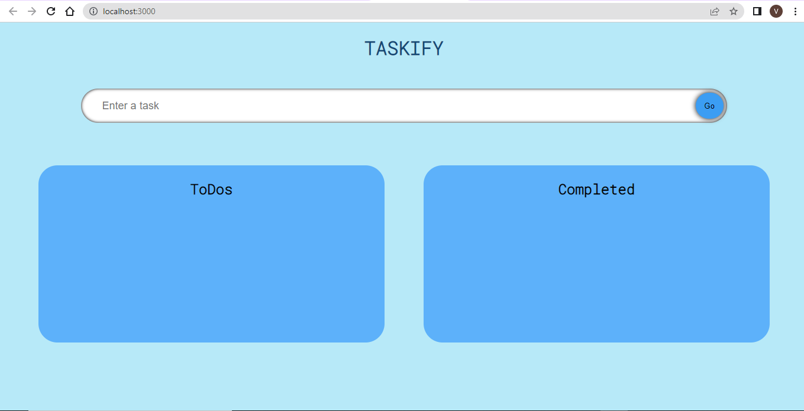
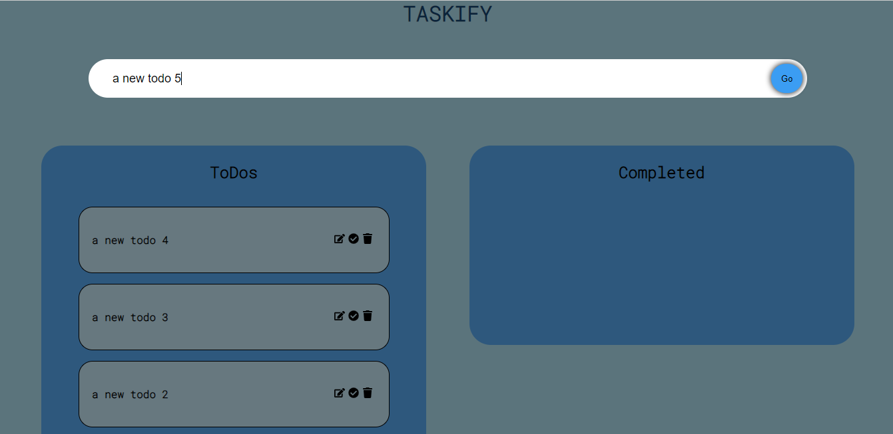
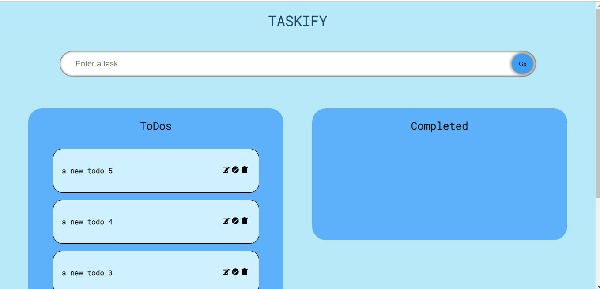
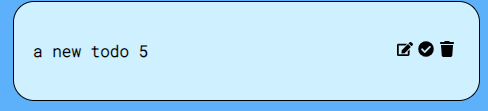
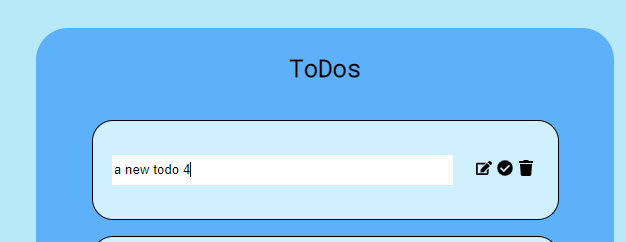
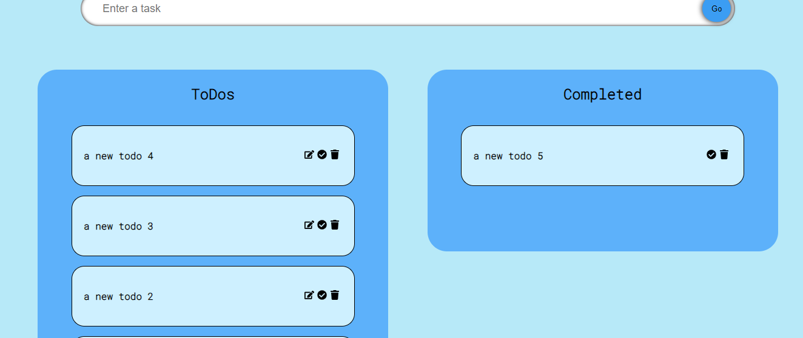
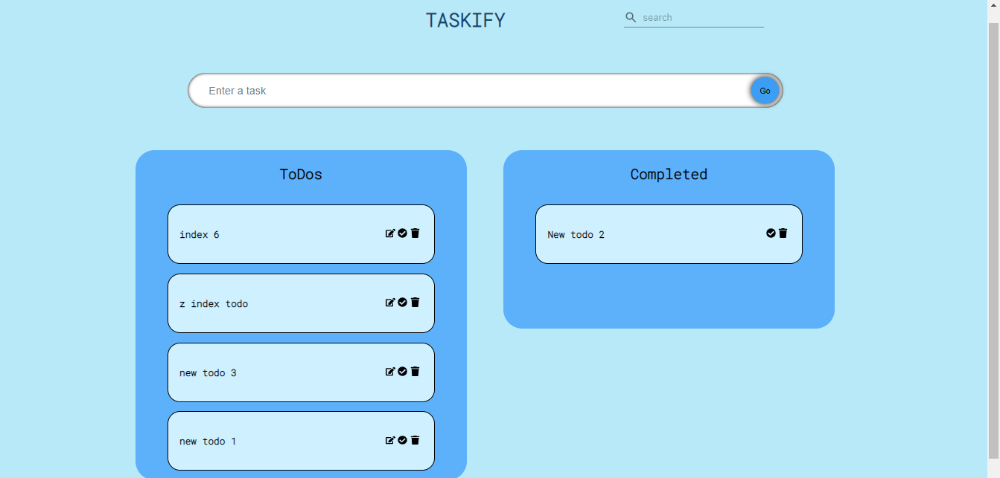
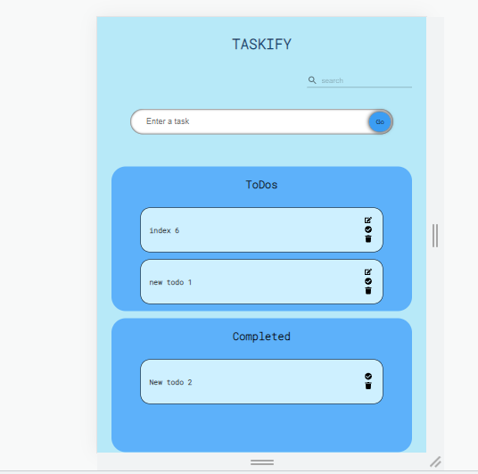

# TASKIFY

## React ToDO in TypeScript with Drag & Drop

A ToDo list capable of marking todo as completed and non completed list,delete,edit and add new todo.

Also has the facility to drag and drop using react drag and drop library

Can sort the todo by draging it in its own conatiner

Uses local storage to store data

Search toDo

 

---

 

## Versions Used

| Stack                   | version |
| ----------------------- | :-----: |
| Node.js                 | 16.14.2 |
| React.js                | 18.2.0  |
| React DND               | 16.0.1  |
| React dnd html5 backend | 16.0.1  |
| Typescript              |  4.7.4  |
| MUI                     |  5.8.6  |
| MUI Icons               |  5.8.4  |

 

---

 

## Project Status

This project is completed

 

---

 

## Installation and Setup Instructions

Clone down this repository. You will need node and npm installed globally on your machine.

Installation:

npm install

To Start Server:

npm start

To Visit App:

localhost:3000/

## ScreenShots

### Homepage

 

 

### Adding New ToDo

 

 

### New ToDo added

 

 

### ToDo card

 
todo content => edit, mark as complete and delete button
 

 

### Editing todo

 

 

### Completed todo

 

 

### Search todo

#### Search todo initial

 

 

#### Search todo results

 

 

### Responsive smaller display

 

 
